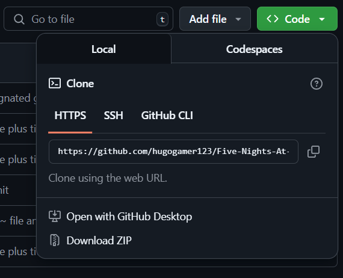

# Five Night's At Jerald's

FNAJ is a fan-game based on the FNAF series. This repository is mainly to keep a backup of the game, however can also be used to add/edit sprites(if you're so kind :) ).

## Installation and how to edit
If you want to edit the files, maybe add/change a sprite, code, music, etc. Or maybe you just want to snoop around, here's how to do so. Just so you know, there's probably a different method to editing the repository but heres my recommended way. Install [Github Desktop](https://desktop.github.com/download/). Then once you've logged in, go to this site again and press open with github desktop.  
